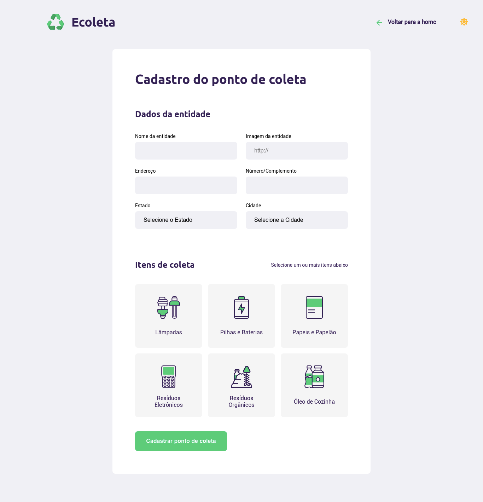

  

<<<<<<< HEAD
## :bulb: Sobre o projeto :bulb:
O objetivo dessa semana era construir uma aplicação que permitisse que usuários cadastrassem pontos de coleta de resíduos, dos mais diversos, através de um formulário. Além disso, os usuários poderiam consultar pontos de coleta por cidade. Tudo isso utilizando as melhores tecnologias, para avançar para o próximo nível :rocket:.

## :clipboard: Tecnologias utilizadas :clipboard:
- HTML
- CSS
- Javascript
- NodeJS
- NPM
- Express
- Nodemon
- SQLite
- Nunjuncks

=======
>>>>>>> 9de5e5805ba7dc052145c1b8bd7bcb2cd8e37f2e

  <h4 align="center">Projeto realizado durante o evento Next Level Week da Rocketseat</h4>

<<<<<<< HEAD
### Página inicial

### Página de cadastro

### Modal de busca

### Página de resultados da busca

### Modo noturno

  
  
=======

  
  
>>>>>>> 9de5e5805ba7dc052145c1b8bd7bcb2cd8e37f2e

